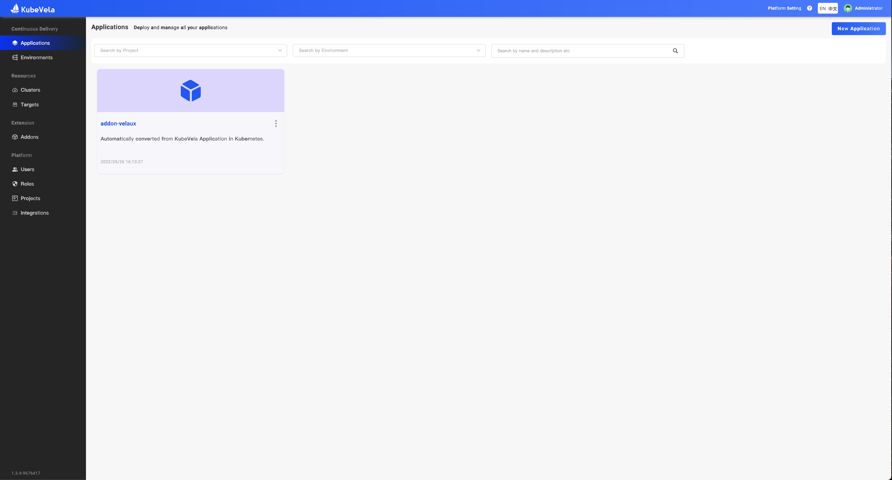
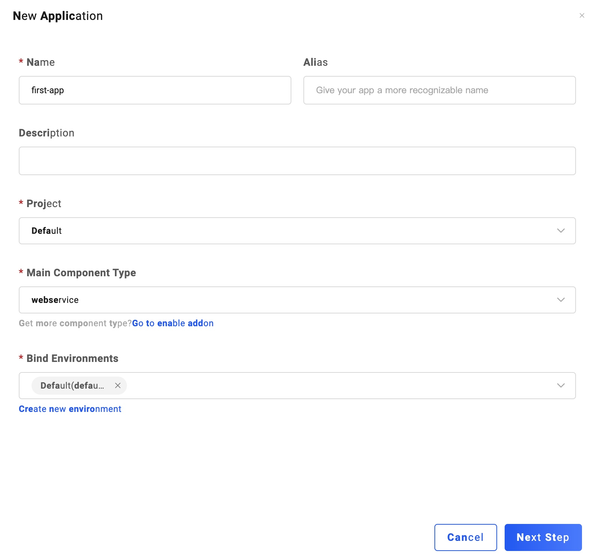
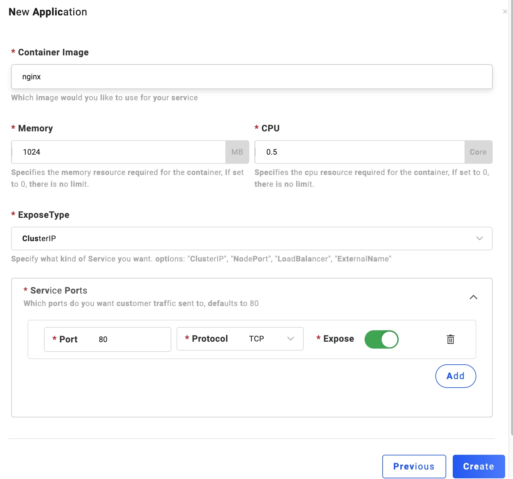
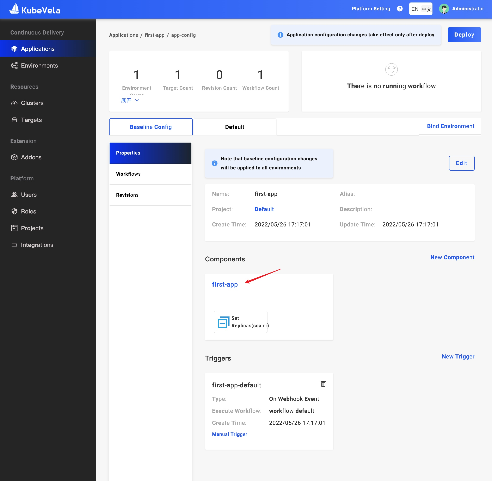
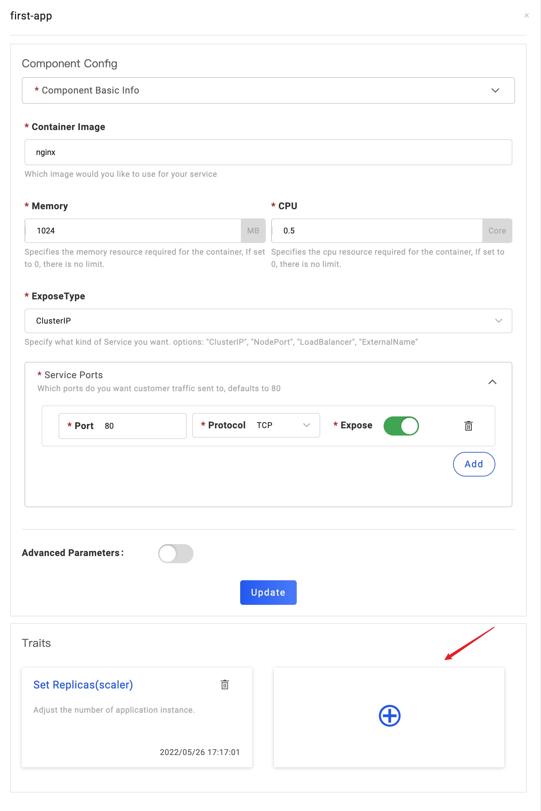
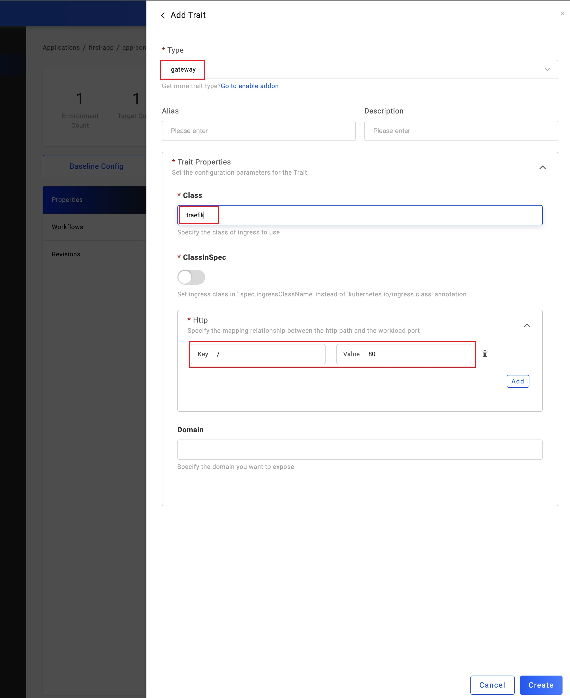
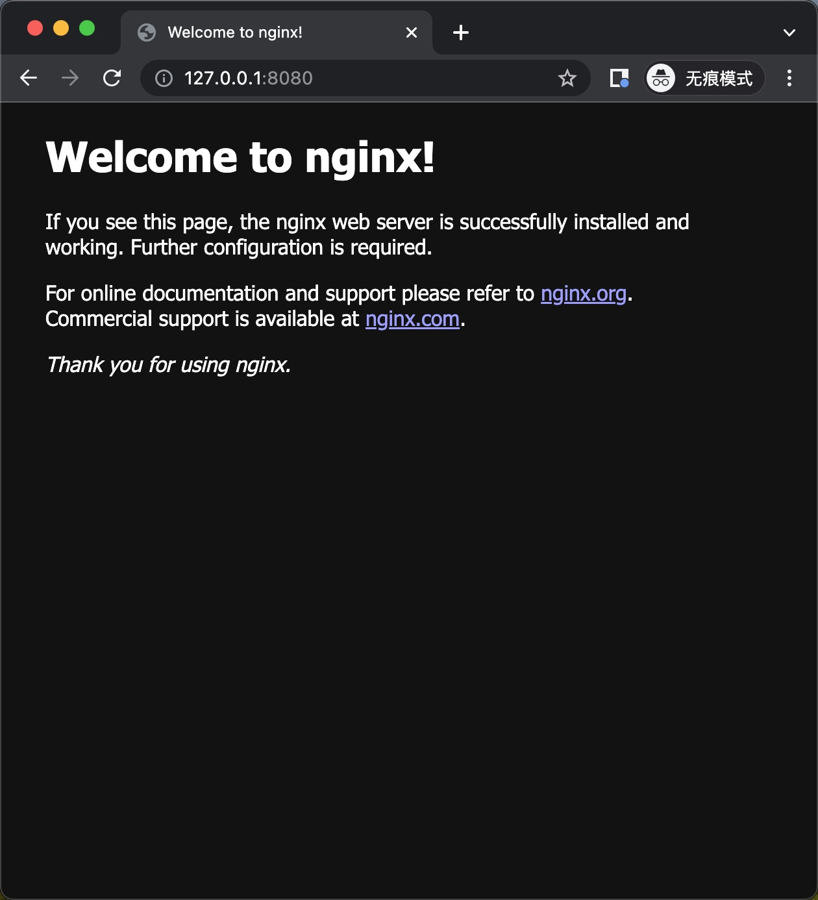

# Setup KubeVela and deliver your first app

VelaD can help you set up KubeVela on your computer. In this article will focus on several points

1. Install VelaD
2. Use VelaD to setup KubeVela
3. Install VelaUX
4. Deliver your first app

## Install VelaD

This is quite easy. Depends on your system, run one of scripts below.

- **Linux/macOS**
```shell
curl -fsSl https://static.kubevela.net/script/install-velad.sh | bash -s 1.4.0
```

- **Windows**
```shell
powershell -Command "iwr -useb https://static.kubevela.net/script/install-velad.ps1 | iex"
```

After install, you can run `velad version` to check velad CLI installed

```shell
velad version
```
```text
Core Version: v1.4.0
VelaD Version: v1.4.0
```

## Use VelaD to setup KubeVela

All you need is run `velad install`, that will help you do things below:

1. start a cluster which needed by KubeVela
2. install KubeVela in cluster
3. install vela CLI on the machine
4. place VelaUX(a web panel addon)resources

```shell
velad install
```
```text
INFO[0000] portmapping '8080:80' targets the loadbalancer: defaulting to [servers:*:proxy agents:*:proxy] 
Preparing K3s images...
...(omit for brevity)

KubeVela control plane has been successfully set up on your cluster.
If you want to enable dashboard, please run "vela addon enable /Users/qiaozp/.vela/addons/velaux"

Keep the token below if you want to restart the control plane
K103585b6be41cc4160c795036d769b1aa2c249a8f046707ab0210c56dcc05e8957::server:kOcAPpOXfVfBbrMBinan..(omit for brevity)

🚀  Successfully install KubeVela control plane
💻  When using gateway trait, you can access with 127.0.0.1:8080
🔭  See available commands with `vela help`
```

> Note: later we'll use gateway trait. Remember we can use 127.0.0.1:8080 to access application with gateway trait.

Now you have KubeVela available in this computer. To verify install result, check if tools and resources ready,
run `velad status`

```shell
velad status
```
```text
Checking cluster status...
K3d images status:
 ✔ image rancher/k3d-tools:5.2.2 ready
 ✔ image rancher/k3d-proxy:5.2.2 ready
 ✔ image rancher/k3s:v1.21.10-k3s1 ready
Cluster(K3d) status:
 ✔ cluster [default] ready
  ✔ kubevela status: deployed
Checking KubeVela status...
Vela status:
 ✔ Vela CLI installed
 ✔ Vela CLI path: /usr/local/bin/vela
 ✔ VelaUX addon dir ready
 ✔ VelaUX addon dir path: /Users/qiaozp/.vela/addons/velaux
```

You could use vela CLI now. try check all available component types. Later we'll use `webservice` type component when deploying first app
```shell
# optional because `velad install` create default cluster
export KUBECONFIG=$(velad kubeconfig --host)
```

```shell
vela comp
```

result:
```text
NAME                    DEFINITION
config-image-registry   autodetects.core.oam.dev
k8s-objects             autodetects.core.oam.dev
cron-task               cronjobs.batch
ref-objects             autodetects.core.oam.dev
raw                     autodetects.core.oam.dev
task                    jobs.batch
worker                  deployments.apps
webservice              deployments.apps
```

## Install VelaUX

VelaUX is a dashboard including UI+API services, it enables you to do everything around application delivery and management.
VelaUX isn't required for KubeVela, but it is an excellent entry to get started.

VelaD has prepared all VelaUX resources (images, addon manifests) for you. Just like it hints when `velad install`, you can enable VelaUX by:

```shell
vela addon enable /Users/<user>/.vela/addons/velaux
```

Here, you have to replace <user> with your own username. After about half a minutes, you will see the output:

```text
Initialized admin username and password: admin / VelaUX12345
To open the dashboard directly by port-forward:
    vela port-forward -n vela-system addon-velaux 9082:80
Select "Cluster: local | Namespace: vela-system | Kind: Service | Name: velaux" from the prompt.
Please refer to https://kubevela.io/docs/reference/addons/velaux for more VelaUX addon installation and visiting method.
```

The default username and password is: `admin` / `VelaUX12345`.

Do as the output says, port-forward velaux and choose "Cluster: local | Namespace: vela-system | Kind: Service | Name: velaux"

```shell
vela port-forward -n vela-system addon-velaux 9082:80
? You have 4 deployed resources in your app. Please choose one: Cluster: local | Namespace: vela-system | Kind: Service | Name: velaux
Forwarding from 127.0.0.1:9082 -> 80
Forwarding from [::1]:9082 -> 80
```

You will see dashboard opened automatically. Use `admin` and password just got to log in and you'll see:



🎉 Congrats! You have successfully installed VelaUX.

## Deliver your first app

Now we'll use VelaUX to deliver your first app, just a Nginx for example.
Notice that this example may be simple. However, you can use the same pattern to deliver more complicated app depends on your stack.

1. Click the `New Application` in top-right of window.
2. Input `first-app` for `Name` and choose `Default(default)` for `Bind Environments`. Click `Next Step`.



3. Input `nginx` for `Container Image`. Click `Create`



4. Click `first-app` in components panel



5. Click the plus button in Traits panel. we'll add a gateway trait, so we can access it from localhost



6. In the detail form, first choose `gateway` in `Type`. Arguments will show below. Then fill two arguments
- Change `Class` to `traefik` to use Traefik packed with VelaD.
- Add a route rule from `/` to `80`, which we'll use localhost:port without sub-path to access port 80 inside.
 
Click the `Create` to add gateway trait to this app.



7. Finally, we can click the `Deploy` button in the right-top of window. This will launch app to K8s Cluster where
   KubeVela runs.

After seven steps. You can check the application healthiness in `Default` tab. When it is running, we can access it with
`127.0.0.1:8080`. That was mentioned when velad install.



# Summary

After follow this blog, you have known how to use VelaD to deploy KubeVela, VelaUX, and deploy application using VelaUX. 

VelaD have more capabilities when getting hands on KubeVela.

- Want to try KubeVela multicluster features? See [multicluster docs](02.multicluster.md)
- Want to expose your cluster to other computer? See [Expose cluster](05.expose-cluster.md)
- Want to apply origin K8s YAML and distribute them to multi-clusters? See [Apply & Distribute docs](03.apply-and-distribute.md)
- Want to deploy KubeVela control plane with higher availability? See [Deploy by Multi-node and Database](04.ha.md)
- Want to use VelaD help develop KubeVela locally? See [Develop KubeVela with VelaD](06.develop_kubevela.md)
