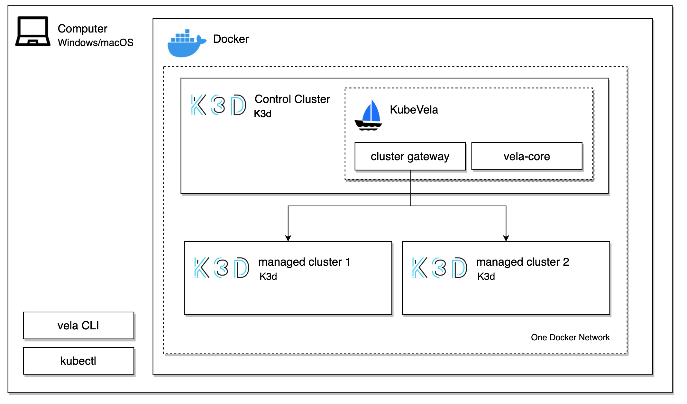

# Multicluster with VelaD

There are many [scenarios](https://kubevela.net/docs/case-studies/multi-cluster#introduction) that developers may want 
to deploy their application across multi-clusters.
This article will introduce you to how make use of VelaD to try multi-cluster features of KubeVela.
If you don't know the basic use of VelaD, you can follow this [document](01.simple.md)

## Prerequisite

Windows/macOS System.

## Targets

In this article, there are several targets:

1. Create a cluster with KubeVela with VelaD as control plane of clusters.
2. Create one cluster as managed cluster.
3. Join managed cluster into KubeVela
4. Deliver one multi-cluster application.

## Architecture

The three targets above will actually build two clusters within the same Docker network(so they can access each other).

The image below shows how multi-cluster scenario works:



When using VelaD, clusters are K3d which running in Docker container. Note that these clusters are in the same Docker 
network, which enables the access between them.

## Steps

### Create control plane

This step has nothing special, `velad install` is all you need which has benn shown in [01.simple](01.simple.md). Here 
we just skip the output of install.

```shell
velad install
```

### Create managed cluster

Create the second cluster, namely managed cluster. 

```shell
velad install --name sub-cluster --cluster-only
```

In this command, use `--name` flag to distinguish it from first cluster which name is `default`.
use `--cluster-only` to tell VelaD not to install KubeVela in this cluster.

**expcted output**

```text
...(omit for brevity)
vela CLI is already installed, skip

Keep the token below if you want to restart the control plane
K10967ee649ab9910497b04c91ad9406e439736df46d1fee85e3451afb8d8cc1da3::server:fgwgYIwkmAQKnmyOIVXc

🚀  Successfully install a pure cluster! 
🔗  If you have a cluster with KubeVela, Join this as sub-cluster:
    vela cluster join $(velad kubeconfig --name sub-cluster --internal)
💻  When using gateway trait, you can access with 127.0.0.1:8082
🔑  To access the cluster, set KUBECONFIG:
    export KUBECONFIG=$(velad kubeconfig --name sub-cluster --host)
```

In the output, wee have seen lots of them. The second one is a new hint which tells how
to join this cluster as managed cluster.

### Join cluster into KubeVela

As hint above, we can use this command to join the cluster

```shell
vela cluster join $(velad kubeconfig --name sub-cluster --internal)
```

Here `velad kubeconfig --name sub-cluster --internal` print a kubeconfig file path which
`vela cluster join` need. The `--internal` flag means this is for docker network.

> Note: all cluster created by VelaD are in docker network "k3d-velad"

**expected output**

```text
Successfully add cluster , endpoint: https://172.31.0.5:6443.
```

Use `vela cluster list` to show clusters joined. The second one is the managed cluster.

```shell
CLUSTER                         ALIAS   TYPE            ENDPOINT                ACCEPTED        LABELS
local                                   Internal        -                       true                  
k3d-velad-cluster-sub-cluster           X509Certificate https://172.31.0.5:6443 true                  
```

### Deliver multi-cluster application.

After join cluster into KubeVela, we can deliver applications to different clusters.

Here is one multi-cluster app example, run:

```shell
cat <<EOF | vela up -f -
apiVersion: core.oam.dev/v1beta1
kind: Application
metadata:
  name: basic-topology
spec:
  components:
    - name: nginx-basic
      type: webservice
      properties:
        image: nginx
      traits:
        - type: expose
          properties:
            port: [80]
  policies:
    - name: topology-sub-cluster
      type: topology
      properties:
        clusters: ["k3d-velad-cluster-sub-cluster"]
EOF
```

This is the first example of KubeVela website for deploy application to multi-cluster.

You can check the status with `vela status`

```shell
vela status basic-topology
```

**output**

```text
About:

  Name:         basic-topology               
  Namespace:    default                      
  Created at:   2022-05-28 18:44:30 +0800 CST
  Status:       running                      

Workflow:

  mode: DAG
  finished: true
  Suspend: false
  Terminated: false
  Steps
  - id:92cn9mrqwm
    name:deploy-topology-sub-cluster
    type:deploy
    phase:succeeded 
    message:

Services:

  - Name: nginx-basic  
    Cluster: k3d-velad-cluster-sub-cluster  Namespace: default
    Type: webservice
    Healthy Ready:1/1
    Traits:
      ✅ expose
```

There you go, you have deployed an application in multiple clusters with whole process is modeled as a declarative deployment
plan. For more usage, check the KubeVela [document](https://kubevela.io/docs/case-studies/multi-cluster)