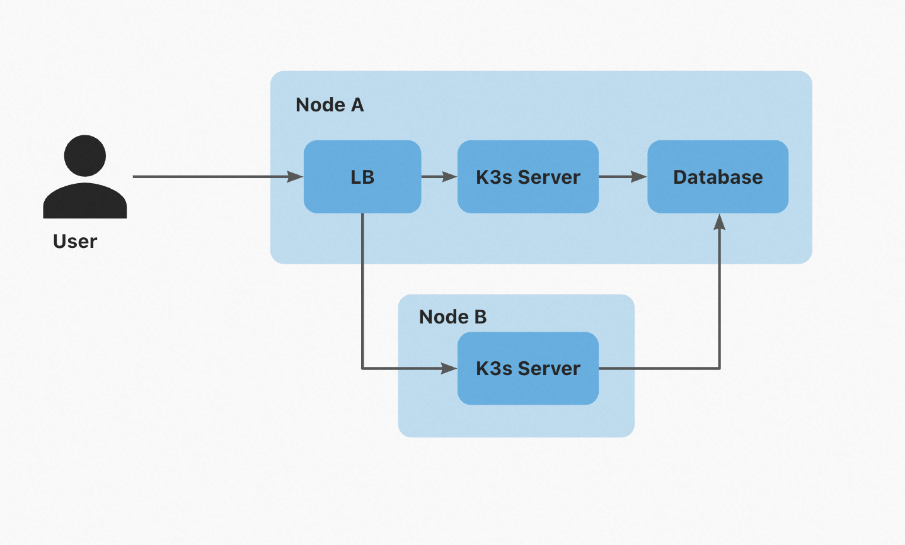

# Deploy by Multi-node and Database

You can use VelaD to deploy more than one master nodes to build KubeVela control plane with higher availability. In this 
way, you need at least two nodes as master nodes. This architecture requires a database to store the cluster metadata and 
a load balancer to forward the network traffic to nodes.

Depending on your needs and budget, you can choose from

1. Multi-node control plane, with database and load balancer on one of the control-plane nodes.
2. Multi-node control plane, with database and load balancer on nodes that are not part of the control plane.

## 1. Database and load balancer on one of the nodes

In this pattern, it requires at least two nodes as master nodes. One node is also used as database and load balancer. Let's
call it "Node A". The other node is used as master node. Let's call it "Node B".



In this architecture, Node A have three roles: database, load balancer and master node. Node B only have master node role.
Node A and B are in the same network. Node A needs a public IP to deploy load balancer for user to access. Node B doesn't
need a public IP.

### Setup Node A

Let's setup database and k3s server on Node A. Load balancer will be deployed after we set up all nodes.

#### Setup database

You can use MySQL/MariaDB, PostgreSQL or etcd as database. The format of database connection string is [here](db-connect-format.md). If you want to set up a database for test, there's a quickstart guide for [MySQL/MariaDB](db-connect-format.md#quickstart).

After install database, you need a database user which can create database and tables. Node B should be able to access the database. In the below example, we use MySQL/MariaDB.

> For example, if MySQL/MariaDB is used, you should expose 3306 port of Node A to Node B.

#### Setup k3s server

Run commands below on Node A. It will set up KubeVela control plane on a k3s server for you.

```shell
velad install --bind-ip=<A_PUBLIC_IP> --database-endpoint="mysql://<DB_USER>:<PASSWORD>@tcp(<A_INTRANET_IP>:3306)/<DB_NAME>" --token=<TOKEN>
```

`<A_PUBLIC_IP>` is the public IP of Node A. It's used to deploy load balancer for user to access.

`<A_INTRANET_IP>` is the intranet IP of Node A. It's used to access database.

`<TOKEN>` is optional. Token will be generated if you don't use this argument. VelaD will print generated or given token.

`<DB_NAME>` is the database name. It will be created if it doesn't exist.

### Setup Node B

Run commands below on Node B. It will set up join Node B to the control plane, basically it's the same with Node A but with
`--cluster-only` argument. It tells VelaD to skip install KubeVela and only join the node.

```shell
velad install --bind-ip=<A_PUBLIC_IP> --database-endpoint="mysql://<DB_USER>:<PASSWORD>@tcp(<A_INTRANET_IP>:3306)/<DB_NAME>" --token=<TOKEN> --cluster-only
```

### Setup load balancer

There's a wizard to help you setup load balancer. Run command below on Node A.

```shell
velad load-balancer wizard
```

It will show result like below. It will show you the command to install nginx and setup it for forwarding the network traffic to master nodes. For

```shell
To setup load-balancer, run the following command on node acts as load-balancer:
  velad load-balancer install --http-port 32196 --https-port 30297 --host=<IP1>,<IP2>
```

Copy and run it on Node A. It will install nginx and setup it for forwarding the network traffic to master nodes.

```shell
velad load-balancer install --http-port 32196 --https-port 30297 --host=<IP1>,<IP2>
```

### Access Cluster

Run command below on any server nodes. Copy the file to any computer which can access the load balancer.

```shell
velad kubeconfig --lb
```

Boom! You can access the KubeVela control plane with this kubeconfig. Failure of any single server won't
affect the availability of the control plane.

## 2. Deploy by multi-node and database 

If you want use VelaD to build KubeVela control plane with higher availability. It's recommended to split the database and
load balancer from the nodes which run KubeVela. The architecture of multi-node control plane is shown below. It consists of:

1. More than two nodes as server nodes.
2. One database (Could be MySQL/MariaDB, PostgreSQL, etcd)
3. One linux node as load balancer. (Or you can use a cloud load balancer)


We only need run several commands on different nodes.

## Setup server nodes

### First node

On the first server node, run

```shell
velad install --bind-ip=<LB_IP> --database-endpoint=<DB_ENNDPOINT> --token=<TOKEN> --node-ip=<IP>
```

`<LB_IP>` is IP of load balancer node. We'll setup it later. Passing it to `bind-ip` helps VelaD generate right
kubeconfig.

`<TOKEN>` is optional. Token will be generated if you don't use this argument. VelaD will print generated or given token
after install.

`<IP>` is optional. If the node have a public IP, you can pass it to `node-ip`.

`<DB_ENDPOINT>` is the database connection string. The format is [here](db-connect-format.md).
> You need to setup database before and make sure all your server nodes can access it.

### Other nodes

On the other node, you need to run `velad install` with the same arguments and **one more**: `--cluster-only`.
`--cluster-only` means skip install KubeVela and only start node. These nodes belong to one cluster and don't install
KubeVela repeatedly.

```shell
velad install --bind-ip=<LB_IP> --database-endpoint=<DB_ENNDPOINT>\
              --token=<TOKEN> \
              --cluster-only
              --node-ip=<IP>
```

`<TOKEN>` should be the same with that in first node.
`--node-ip=<IP>` is optional. If the node have a public IP, you can pass it to `node-ip`.

## Setup load balancer

On any master node, run

```shell
velad load-balancer wizard
```

It will show you the command to install nginx and setup it for forwarding the network traffic to master nodes. For
example:

```shell
To setup load-balancer, run the following command on node acts as load-balancer:
  velad load-balancer install --http-port 32196 --https-port 30297 --host=<IP1>,<IP2>
```

### Option1: Use another node as load balancer

Paste the command to the load balancer node and run it.

```shell
velad load-balancer install --http-port 32196 --https-port 30297 --host=<IP1>,<IP2>
```

`<IPx>` is IPs of server nodes. It can be public IP or private IP. As long as the load balancer node can access it.

This will call package manager of system to install nginx and setup it for forwarding the network traffic to server
nodes.

### Option2: Use cloud load balancer

If you prefer to use cloud load balancer, you can configure it to forward the network traffic to server nodes. For
example you can configure the port-forwarding of Alibaba Cloud SLB like this. The `6443` is required to access the
cluster. The `80` and `443` are optional. You can pick other ports or don't forward them. They help to access the
Ingress in the cluster. The `32196` and `30297` are the ports printed by `velad load-balancer wizard`. It's decided
when `velad install` is called and can be different in different clusters.

```text
6443 -> 6443
80 -> 32196
443 -> 30297
```

## Access cluster

Run command below on any server nodes. Copy the file to any computer which can access the load balancer.

```shell
velad kubeconfig --lb
```

Boom! You can access the KubeVela control plane with this kubeconfig. Failure of any single server won't
affect the availability of the control plane.